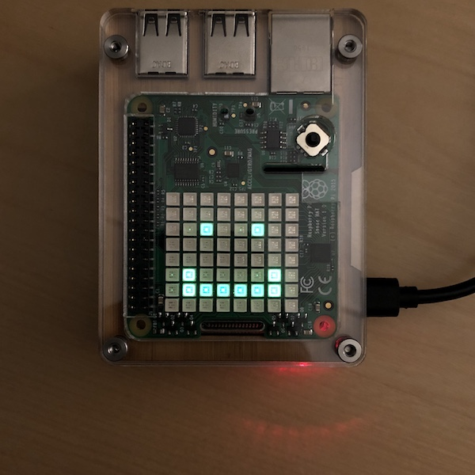

## Sandra the Sensor Bot


Hello, thank you for checking out my repository. Sandra the Sensor Bot is a twitter bot, with an interesting twist. This was really a way for me to incorporate hardware into a project, something I've never done before. 

The codebase is mainly written in Python. Sandra currently has the ability to read the temperature, humidity, and air pressure. 

I eventually want to move to also reading gas and air quality, but that requires additional hardware that I do not have at the moment. 


## Requirements

This is not a usual web development project since there is hardware required. 

#### Hardware required: 

* [Raspberry Pi 3b+](https://www.raspberrypi.org/products/raspberry-pi-3-model-b-plus/) or [Raspberry Pi 4](https://www.raspberrypi.org/products/raspberry-pi-4-model-b/) - This is used to run the software needed. 
* [Raspberry Pi Sense Hat ](https://www.raspberrypi.org/products/sense-hat/) - This is used to measure the temperature, humidity, and air pressure. 

#### Additional hardware(highly recommended)

* 40-pin GPIO female-to-male ribbon cable - The heat from the Raspberry Pi CPU will warm the Sense Hat, causing inaccurate temperature readings. The ribbon cable allows for the Sense Hat to be moved away from the heat source. 

#### Installations and setup

***As a reminder, you will need the required hardware. This will not work unless you have a Raspberry Pi and Sense HAT.***

Python3 must be installed on your Raspberry Pi. Additionally, you may need to install the following: 

* Twython
* dotenv
* python-dotenv
* python3-matplotlib

You may run into problems depending on which dependency manager you use.
Most of the dependencies should be preinstalled on your Raspberry Pi OS. If you do run into problems, you can try running:

```
sudo apt-get install <MISSING_PACKAGE_HERE>
```
You will also need to sign up for a Twitter Developer Account. Please see the instructions to get a [Twitter Developer Account](https://developer.twitter.com/en). Once you have an account, in the home directory of the repository, run the following: `touch .env` and then open the .env file. Paste the following in here: 

```
# API key, Secret Key, and Bearer Token from Twitter
API_KEY=<API_KEY_GOES_HERE>
API_SECRET_KEY=<API_SECRET_KEY_GOES_HERE>
BEARER_TOKEN=<BEARER_TOKEN_GOES_HERE>

# access token and secret from Twitter
ACCESS_TOKEN=<ACCESS_TOKEN_GOES_HERE>
ACCESS_TOKEN_SECRET=<ACCESS_TOKEN_SECRET_GOES_HERE>
```


## How to run the program *** WIP ***

In your terminal, run:
```
python3 twitter.py
```
This will post the message with the data to your account.
